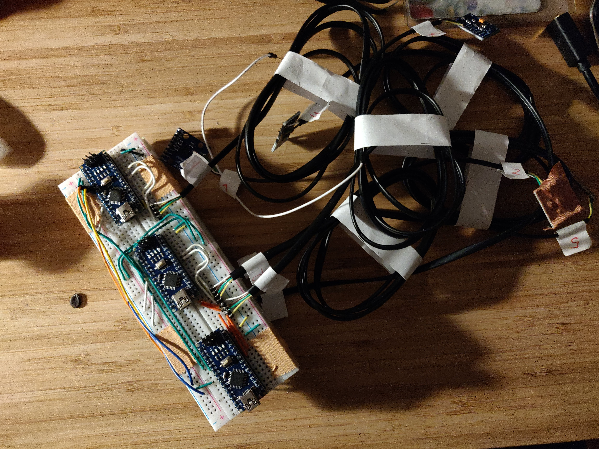
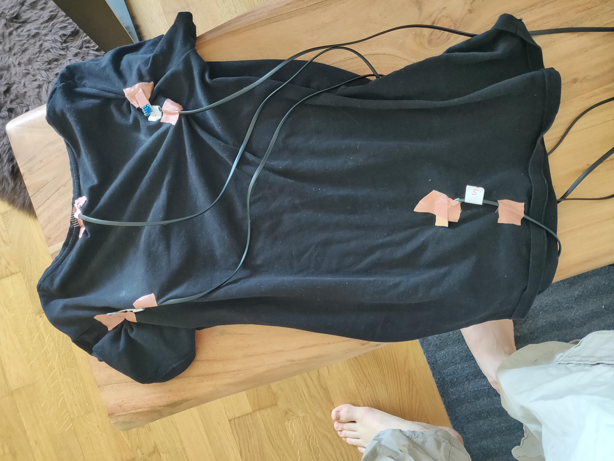
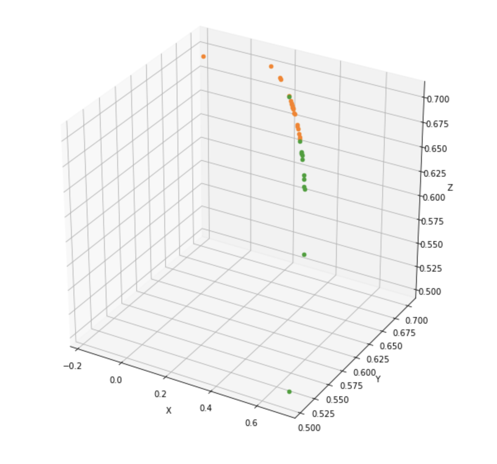

## Sitting posture notifications

Idea of the project is to build simple yet efficient _thing_ that can help me to keep a "good" posture.

{:toc}

### 2019-09-17

Using simple 3-axis accelerometers on a different parts of a body and recording the camera for reference I have recorded images of my posture along with accelerometers data.

 

Some of the sensors can clearly distinguish "good" postures from "bad"

